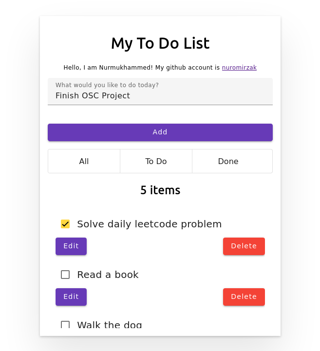
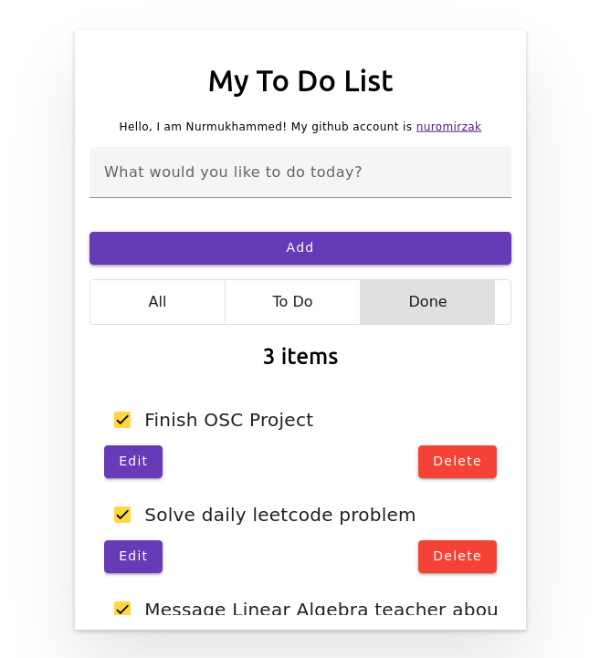

# To-Do List Web Application

This is a simple To-Do List web application built with Angular on the frontend and Spring Boot on the backend. The application allows users to manage their tasks by adding, editing, and deleting them.

|             1st Example             |             2nd Example             |
|:-----------------------------------:|:-----------------------------------:|
|  |  |

## Backend

The backend is written in Java using Spring Boot framework. The backend code provides RESTful APIs that allow the frontend to interact with the database.

### Technologies Used

- Java 17
- Spring Boot 3
    - Spring Data JPA
    - Spring Web
    - Spring Validation
- PostgresSQL 14
- Lombok

### Building and Running the Backend

To build and run the backend, follow these steps:

1. Install Java 17 and PostgresSQL
2. Create a database in PostgresSQL with the name `todo_db`
3. Navigate to the `backend` directory in your terminal
4. Run `./mvnw spring-boot:run` to start the backend server

P.S. No need to create a table in the database. Spring Boot will automatically create the table for you.

The server will start on port 4000 and is accessible at http://localhost:4000.

## Frontend

The frontend is built with Angular framework. The user interface provides a simple form to add, edit, and delete tasks. The user can also filter tasks based on their status (all, active, or completed).

### Technologies Used

- Angular 15
- Material UI

### Building and Running the Frontend

To build and run the frontend, follow these steps:

1. Install Node.js and Angular CLI
2. Navigate to the `frontend` directory in your terminal
3. Run the following command to install the dependencies: `npm install`
4. Run `ng serve` to start the frontend server

The server will start on port 4200 and is accessible at http://localhost:4200.

## API Endpoints

The backend provides the following API endpoints:

- GET `/todo/all`: Retrieves all tasks from the database
- GET `/todo/{id}`: Retrieves a task with the given id
- POST `/todo/save`: Creates a new task in the database
- PUT `/todo/{id}`: Updates a task with the given id
- DELETE `/todo/delete/{id}`: Deletes a task with the given id

All API endpoints are prefixed with `/todo` and are accessible at http://localhost:4000/todo.